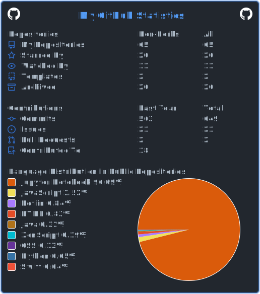

#  Hi, I’m @Abdullah-Hamad-Almousa

<h3 align="center">ML Engineer | Production AI Systems & Model Deployment | AWS</h3>

<h2 align="center">Connect With Me</h2>

<table align="center">
  <tr>
    <td align="center">
      
    </td>
    <td align="center">
      
    </td>
    <td align="center">
      
    </td>
    <td align="center">
      
    </td>
    <td align="center">
      
    </td>
  </tr>
</table>

 

## About Me

I build and deploy end-to-end machine learning systems in production environments on AWS. I specialize in integrating AI into real-world applications from backend APIs to mobile-ready solutions bridging the gap between data science and software engineering.

- **End-to-end ML pipelines:** data preprocessing, model training, evaluation, and deployment  
- **Cloud & Production:** AWS infrastructure for scalable model serving  
- **AI in Applications:** connecting ML models to apps via FastAPI, Ktor, and Kotlin backends  
- **Modern AI:** comfortable with LLMs and generative AI paradigms 

 

## Featured Projects

<table align="center">
  <tr>
    <td width="50%" valign="top">
      <h3 align="center"><a href="https://github.com/Abdullah-Hamad-Almousa/UsedCarsModel">UsedCarsModel</a></h3>
      

        
        
        
        
      

      
End-to-end regression pipeline that predicts used car prices based on vehicle features. Covers data cleaning, feature engineering, model training, and evaluation.

    </td>
    <td width="50%" valign="top">
      <h3 align="center"><a href="https://github.com/Abdullah-Hamad-Almousa/Android_Malware_detection">Android Malware Detection</a></h3>
      

        
        
        
      

      
ML classification model for detecting Android malware. Achieved <b>99.3% accuracy</b> on the primary dataset and <b>96% accuracy</b> on the secondary dataset.

    </td>
  </tr>
</table>

 

  Languages and Tools

<table align="center">
  <tr>
    <td align="center" width="96">
    
       Kotlin
    </td>
    <td align="center" width="96">
    
       CSS
    </td>
    <td align="center" width="96">
    
       HTML
    </td>
    <td align="center" width="96">
    
       MySQL
    </td>
    <td align="center" width="96">
    
       PostgreSQL
    </td>
  </tr>
  <tr>
    <td align="center" width="96">
      
       Python
    </td>
    <td align="center" width="96">
      
       Anaconda
    </td>
    <td align="center" width="96">
      
       Postman
    </td>
    <td align="center" width="96">
      
       GitHub
    </td>
    <td align="center" width="96">
      
       Git
    </td>
  </tr>
  <tr>
    <td align="center" width="96">
      
       Jupyter
    </td>
    <td align="center" width="96">
      
       Kaggle
    </td>
    <td align="center" width="96">
      
       MongoDB
    </td>
    <td align="center" width="96">
      
       NumPy
    </td>
    <td align="center" width="96">
      
       OpenCV
    </td>
  </tr>
  <tr>
    <td align="center" width="96">
      
       Pandas
    </td>
    <td align="center" width="96">
      
       PyCharm
    </td>
    <td align="center" width="96">
      
       PyTorch
    </td>
    <td align="center" width="96">
      
       TensorFlow
    </td>
    <td align="center" width="96">
      
       VSCode
    </td>
  </tr>
  <tr>
    <td align="center" width="96">
      
       Ktor
    </td>
    <td align="center" width="96">
      
       FastAPI
    </td>
    <td align="center" width="96">
      
       SQLite
    </td>
    <td align="center" width="96">
      
       TypeScript
    </td>
    <td align="center" width="96">
      
       Node.JS
    </td>
  </tr>
  <tr>
    <td align="center" width="96">
      
       Scikit-learn
    </td>
    <td align="center" width="96">
      
       SQLite
    </td>
    <td align="center" width="96">
      
       Seaborn
    </td>
    <td align="center" width="96">
      
       
    </td>
    <td align="center" width="96">
      
       
    </td>
  </tr>
</table>

 

<h2 align="center"> GitHub Stats </h2>

<table align="center">
  <tr>
    <td align="center">
      
    </td>
    <td align="center">
      
    </td>
  </tr>
  

  

</table>

 

  

